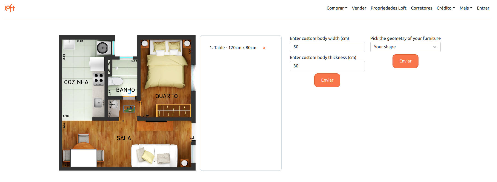

# Welcome to Interactive Plan!

This is an app intended for users who might be interested in buying apartments. It's inspired by [Loft](https://loft.com.br/)'s layout and suggests a new feature that will allow a possible buyer to not only see the fully decorated floorplan, but also interact with it through a scaled model of a person.
The idea is helping the buyer have a realistic view of how well they are able to move inside the apartment with all its furniture.

Talking about furniture, the user will also be able to add geometric shapes representing real-life objects they might want to place in the apartment, so they are not limited by the initial layout suggestion and can actually see how any objects they might have would fit in the available space before deciding to schedule a visit.

## Technology involved

This project was developed using:

✅  React

✅  Redux

✅  Hooks

✅  Bootstrap

✅  React-Konva

✅  HTML, CSS, JavaScript

✅  Mobile-first

## Features

✅  Responsive header and navbar (linking to original Loft pages)

✅  Scaled decorated floorplan

✅  Human model in scale, rotatable and freely draggable

✅  Custom dimentions for human model, so users of all sizes can be represented

✅  Custom furniture shapes in scale, freely draggable and deletable

## Future Features
✅  Visible labels for shapes on hover

✅  Rotatable shapes

✅  Skins for the shapes (user will be able to say if shape is, for example, a wheelchair, and the shape would have a wheelchair skin instead of being just a white block)

## Deploy (via Heroku)
Available in desktop and mobile versions

https://interactive-plan.herokuapp.com/

